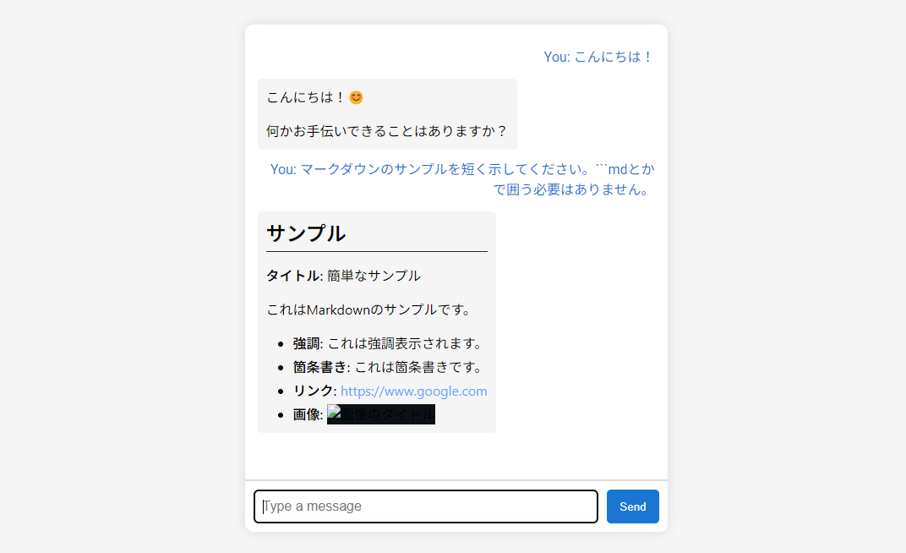

# Dockerで動かせるGemma2 チャットボット

このプロジェクトは、HuggingFaceから提供される事前学習モデル「Gemma2」を使ったシンプルなAIチャットボットをPython、Flask、Dockerを使って実装したものです。ウェブインターフェースを通して、ユーザーはブラウザから直接チャットボットと対話することができます。



## プロジェクト構成

- `Dockerfile`：アプリのコンテナ環境を定義
- `app.py`：チャットボットのバックエンドロジックを実装
- `compose.yml`：プロジェクトを実行するためのDocker Compose設定
- `docs/sample.png`：チャットボットのサンプル画像
- `requirements.txt`：Pythonの依存パッケージリスト
- `templates/index.html`：チャットボットのフロントエンドインターフェース

## 主な機能

- **テキスト生成**：`google/gemma-2-2b-jpn-it`モデルを使用してユーザーの入力に対して応答を生成します。
- **ウェブインターフェース**：チャットを行うための使いやすいUIを提供。
- **REST API**：チャットボットと対話するためのAPIエンドポイント（`/chat`）を提供。
- **Docker化**：Dockerを利用して簡単にデプロイ可能。

## 前提条件

- [Docker](https://www.docker.com/) をインストールしていること
- （オプション）[Docker Compose](https://docs.docker.com/compose/install/) のインストール

## 必要スペック
- このコンテナだけでメモリを10GBほど使います。

## はじめに

以下の手順に従って、このプロジェクトを動かします。

### 1. リポジトリをクローン

リポジトリをローカルにクローンします。

```bash
git clone <repository_url>
cd <repository_directory>
```

### 2. Dockerでビルドと実行

Docker Composeを使用してアプリケーションをビルドおよび実行します。

```bash
docker-compose up --build
```

このコマンドにより、`compose.yml`に基づいてDockerイメージがビルドされ、コンテナが起動します。チャットボットは`http://localhost:8080`でアクセス可能です。

### 3. チャットボットにアクセス

ウェブブラウザを開き、以下のURLにアクセスします。

```
http://localhost:8080
```

チャットインターフェースが表示され、AIとの対話を開始できます。

## 設定

- **モデル**：使用するモデルは`compose.yml`の環境変数`MODEL_NAME`で指定されています。他のHuggingFaceモデルに変更することも可能です。
- **APIトークン**：安全にモデルにアクセスするために`HF_TOKEN`にHuggingFaceのAPIトークンを設定してください。

## ファイル詳細

### Dockerfile

- Python 3.12をベースにしたコンテナ環境を定義しています。
- 必要なファイルをコピーし、依存関係をインストールし、起動コマンドを設定しています。

### app.py

- Flaskアプリケーションで、以下の2つのエンドポイントを提供します。
  - `/`：チャットボットのウェブページを提供。
  - `/chat`：ユーザーの入力に対して応答を生成するAPIエンドポイント。

### compose.yml

- 必要なポート、ボリューム、環境変数を設定してコンテナを起動します。

### requirements.txt

- `torch`, `transformers`, `Flask`などの依存関係が記載されています。

### templates/index.html

- チャットボットのウェブインターフェースを提供するHTMLファイルです。
- HTML、CSS、JavaScriptを使って、シンプルかつユーザーフレンドリーなチャットUIを実装しています。

## 使い方

### メッセージの送信

ウェブインターフェースを通じて、メッセージを入力し「Send」ボタンをクリックすると、チャットボットが応答を生成します。

### APIエンドポイント

プログラム的にチャットボットと対話するには、`/chat`エンドポイントを使用します。

- **URL**：`http://localhost:8080/chat`
- **メソッド**：`POST`
- **リクエストボディ**：
  ```json
  {
    "message": "あなたのメッセージ"
  }
  ```
- **レスポンス**：
  ```json
  {
    "response": "チャットボットの応答"
  }
  ```

## 依存関係

このプロジェクトの依存関係は`requirements.txt`に記載されています。

- `accelerate`, `torch`, `transformers`：モデルの処理と推論に必要。
- `Flask`, `Flask-Cors`：ウェブサーバーの構築とクロスオリジンリクエストの処理に使用。
- `werkzeug`：WSGIサーバーの機能を提供。

## ライセンス

このスクリプト自体は煮るなり焼くなりご自由にご利用ください。

## コントリビューション

コントリビューションは大歓迎です！フォークして改善点をプルリクエストで送ってください。
